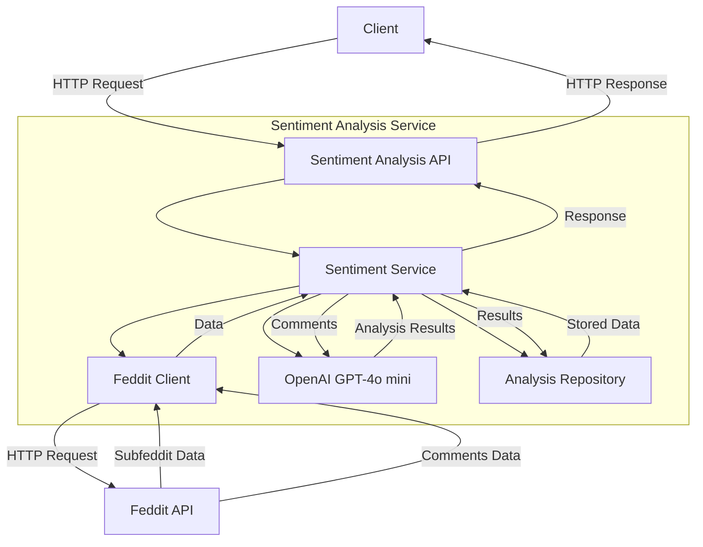
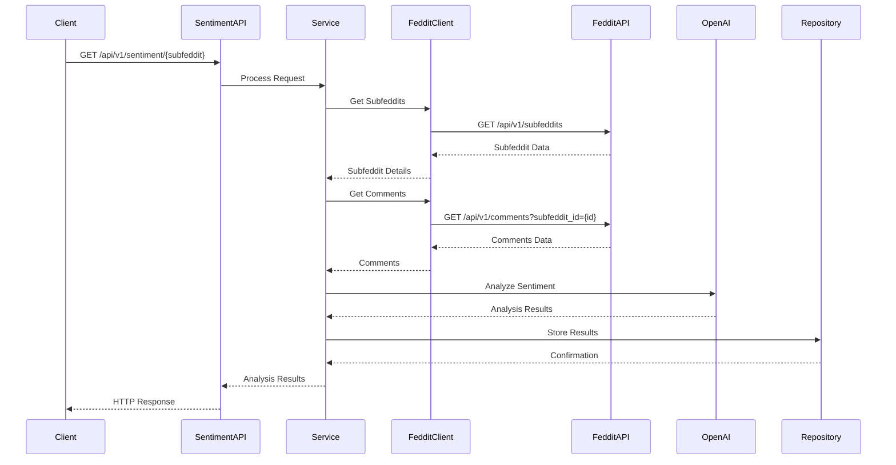
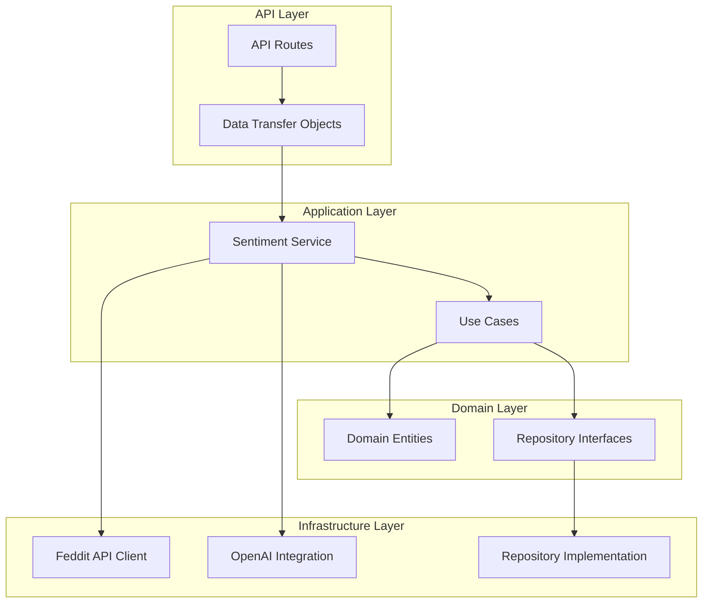
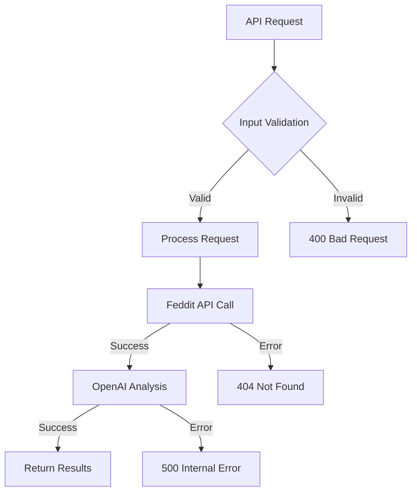

# Sentiment Analysis Microservice Architecture

## System Overview



## Data Flow



## Component Architecture



## Key Components

1. **API Layer**
   - FastAPI application
   - REST endpoints
   - Request/Response DTOs

2. **Application Layer**
   - Sentiment Service
   - Use Cases
   - Business Logic

3. **Domain Layer**
   - Entities (Comment, SentimentAnalysis)
   - Repository Interfaces

4. **Infrastructure Layer**
   - Feddit API Client
   - OpenAI Integration
   - Repository Implementation

## Data Flow Steps

1. Client makes a request to analyze sentiment for a subfeddit
2. API routes receive the request and validate parameters
3. Sentiment Service orchestrates the analysis:
   - Fetches comments from Feddit API
   - Sends comments to OpenAI for analysis
   - Stores results in repository
4. Results are returned to the client

## Error Handling



## Key Design Patterns

### 1. Dependency Injection
- Used for managing dependencies between components
- Implemented using FastAPI's dependency injection system
- Promotes loose coupling and testability

### 2. Repository Pattern
- Abstracts data access logic
- Provides a clean interface for data operations
- Enables easy switching of data sources

### 3. Factory Pattern
- Used for creating complex objects
- Implemented in the infrastructure layer for client creation

### 4. Strategy Pattern
- Used for sentiment analysis implementation
- Allows easy switching between different analysis strategies

## Error Handling

The system implements a comprehensive error handling strategy:

1. **Domain Errors**
   - Custom exceptions for domain-specific errors
   - Proper error categorization

2. **API Errors**
   - HTTP status codes
   - Consistent error response format
   - Detailed error messages

3. **Logging**
   - Structured logging
   - Different log levels
   - Error tracking

## Security Considerations

1. **API Security**
   - Input validation
   - Rate limiting (planned)
   - CORS configuration

2. **Data Security**
   - Environment variables for sensitive data
   - No sensitive data in logs
   - Secure API key handling

## Scalability

The architecture supports scalability through:

1. **Horizontal Scaling**
   - Stateless API design
   - Containerization support
   - Load balancing compatibility

2. **Performance Optimization**
   - Caching (planned)
   - Async operations
   - Efficient data processing

## Monitoring and Observability

1. **Logging**
   - Structured logging
   - Log levels
   - Error tracking

2. **Metrics**
   - API performance metrics
   - Error rates
   - Response times

## Future Considerations

1. **Planned Features**
   - Authentication and authorization
   - Rate limiting
   - Caching layer
   - More sophisticated sentiment analysis

2. **Architecture Evolution**
   - Microservices split (if needed)
   - Event-driven architecture
   - Message queue integration

## Service Dependencies

### Sentiment Analysis Service
The sentiment analysis service has the following dependencies:

1. **Feddit API**
   - Required for fetching subfeddits and comments
   - Configured via `FEDDIT_API_URL` environment variable
   - Must be available before the service starts

2. **OpenAI API**
   - Required for sentiment analysis
   - Configured via `OPENAI_API_KEY` environment variable
   - Must be available for sentiment analysis to work

3. **Memory Repository**
   - Used for storing sentiment analysis results
   - In-memory storage, no external database required
   - Data is not persisted between service restarts

### Docker Service Dependencies
In the Docker Compose configuration:
- `sentiment-analysis` service depends on `feddit` service
- No database dependency is required
- Services are connected via Docker's default network

### Health Checks
- Feddit API health check: `http://feddit:8080/api/v1/version`
- Sentiment Analysis health check: `http://localhost:8000/health`
- Health checks run every 30 seconds with 3 retries 

## Dependency Injection

The application uses FastAPI's built-in dependency injection system for managing dependencies. This approach provides several benefits:

1. **FastAPI Integration**
   - Native integration with FastAPI's dependency injection system
   - Automatic dependency resolution
   - Type-safe dependency injection
   - Easy testing through dependency overrides

2. **Dependency Providers**
   - Located in `src/sentiment_analysis/api/dependencies.py`
   - Each provider is a function that returns a dependency instance
   - Dependencies are lazily initialized
   - Easy to mock for testing

3. **Service Dependencies**
   ```python
   def get_sentiment_service(
       feddit_client: FedditClient = Depends(get_feddit_client),
       sentiment_analyzer: SentimentAnalyzer = Depends(get_sentiment_analyzer),
       sentiment_analysis_repository: SentimentAnalysisRepository = Depends(get_sentiment_analysis_repository)
   ) -> SentimentService:
       return SentimentService(
           feddit_client=feddit_client,
           sentiment_analyzer=sentiment_analyzer,
           sentiment_analysis_repository=sentiment_analysis_repository
       )
   ```

4. **Testing**
   - Dependencies can be easily overridden in tests
   - Each dependency can be mocked independently
   - Test fixtures can provide test-specific implementations 